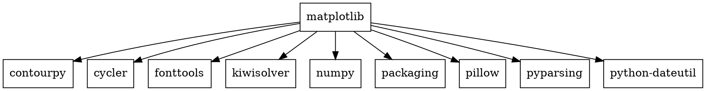
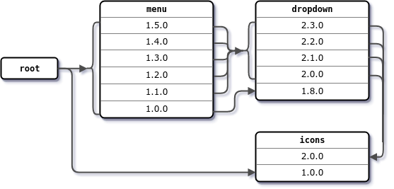

# Задание 1
### Условие

Вывести служебную информацию о пакете matplotlib (Python). Разобрать основные элементы содержимого файла со служебной информацией из пакета. Как получить пакет без менеджера пакетов, прямо из репозитория?

### Код

- Без репозитория
```bash
pip show matplotlib
```
- С репозиторием
```bash
git clone https://github.com/matplotlib/matplotlib.git
cd matplotlib
pip install .
pip show matplotlib
```

### Вывод

```
Name: matplotlib
Version: 3.9.2
Summary: Python plotting package
Home-page: https://matplotlib.org
Author: John D. Hunter, Michael Droettboom
Author-email: Unknown <matplotlib-users@python.org>
License: License agreement for matplotlib versions 1.3.0 and later
=========================================================

1. This LICENSE AGREEMENT is between the Matplotlib Development Team
("MDT"), and the Individual or Organization ("Licensee") accessing and
otherwise using matplotlib software in source or binary form and its
associated documentation.

2. Subject to the terms and conditions of this License Agreement, MDT
hereby grants Licensee a nonexclusive, royalty-free, world-wide license
to reproduce, analyze, test, perform and/or display publicly, prepare
derivative works, distribute, and otherwise use matplotlib
alone or in any derivative version, provided, however, that MDT's
License Agreement and MDT's notice of copyright, i.e., "Copyright (c)
2012- Matplotlib Development Team; All Rights Reserved" are retained in
matplotlib  alone or in any derivative version prepared by
Licensee.

3. In the event Licensee prepares a derivative work that is based on or
incorporates matplotlib or any part thereof, and wants to
make the derivative work available to others as provided herein, then
Licensee hereby agrees to include in any such work a brief summary of
the changes made to matplotlib .

4. MDT is making matplotlib available to Licensee on an "AS
IS" basis.  MDT MAKES NO REPRESENTATIONS OR WARRANTIES, EXPRESS OR
IMPLIED.  BY WAY OF EXAMPLE, BUT NOT LIMITATION, MDT MAKES NO AND
DISCLAIMS ANY REPRESENTATION OR WARRANTY OF MERCHANTABILITY OR FITNESS
FOR ANY PARTICULAR PURPOSE OR THAT THE USE OF MATPLOTLIB
WILL NOT INFRINGE ANY THIRD PARTY RIGHTS.

5. MDT SHALL NOT BE LIABLE TO LICENSEE OR ANY OTHER USERS OF MATPLOTLIB
 FOR ANY INCIDENTAL, SPECIAL, OR CONSEQUENTIAL DAMAGES OR
LOSS AS A RESULT OF MODIFYING, DISTRIBUTING, OR OTHERWISE USING
MATPLOTLIB , OR ANY DERIVATIVE THEREOF, EVEN IF ADVISED OF
THE POSSIBILITY THEREOF.

6. This License Agreement will automatically terminate upon a material
breach of its terms and conditions.

7. Nothing in this License Agreement shall be deemed to create any
relationship of agency, partnership, or joint venture between MDT and
Licensee.  This License Agreement does not grant permission to use MDT
trademarks or trade name in a trademark sense to endorse or promote
products or services of Licensee, or any third party.

8. By copying, installing or otherwise using matplotlib ,
Licensee agrees to be bound by the terms and conditions of this License
Agreement.

License agreement for matplotlib versions prior to 1.3.0
========================================================

1. This LICENSE AGREEMENT is between John D. Hunter ("JDH"), and the
Individual or Organization ("Licensee") accessing and otherwise using
matplotlib software in source or binary form and its associated
documentation.

2. Subject to the terms and conditions of this License Agreement, JDH
hereby grants Licensee a nonexclusive, royalty-free, world-wide license
to reproduce, analyze, test, perform and/or display publicly, prepare
derivative works, distribute, and otherwise use matplotlib
alone or in any derivative version, provided, however, that JDH's
License Agreement and JDH's notice of copyright, i.e., "Copyright (c)
2002-2011 John D. Hunter; All Rights Reserved" are retained in
matplotlib  alone or in any derivative version prepared by
Licensee.

3. In the event Licensee prepares a derivative work that is based on or
incorporates matplotlib  or any part thereof, and wants to
make the derivative work available to others as provided herein, then
Licensee hereby agrees to include in any such work a brief summary of
the changes made to matplotlib.

4. JDH is making matplotlib  available to Licensee on an "AS
IS" basis.  JDH MAKES NO REPRESENTATIONS OR WARRANTIES, EXPRESS OR
IMPLIED.  BY WAY OF EXAMPLE, BUT NOT LIMITATION, JDH MAKES NO AND
DISCLAIMS ANY REPRESENTATION OR WARRANTY OF MERCHANTABILITY OR FITNESS
FOR ANY PARTICULAR PURPOSE OR THAT THE USE OF MATPLOTLIB
WILL NOT INFRINGE ANY THIRD PARTY RIGHTS.

5. JDH SHALL NOT BE LIABLE TO LICENSEE OR ANY OTHER USERS OF MATPLOTLIB
 FOR ANY INCIDENTAL, SPECIAL, OR CONSEQUENTIAL DAMAGES OR
LOSS AS A RESULT OF MODIFYING, DISTRIBUTING, OR OTHERWISE USING
MATPLOTLIB , OR ANY DERIVATIVE THEREOF, EVEN IF ADVISED OF
THE POSSIBILITY THEREOF.

6. This License Agreement will automatically terminate upon a material
breach of its terms and conditions.

7. Nothing in this License Agreement shall be deemed to create any
relationship of agency, partnership, or joint venture between JDH and
Licensee.  This License Agreement does not grant permission to use JDH
trademarks or trade name in a trademark sense to endorse or promote
products or services of Licensee, or any third party.

8. By copying, installing or otherwise using matplotlib,
Licensee agrees to be bound by the terms and conditions of this License
Agreement.
Location: C:\Users\Max\AppData\Local\Programs\Python\Python312\Lib\site-packages
Requires: contourpy, cycler, fonttools, kiwisolver, numpy, packaging, pillow, pyparsing, python-dateutil
Required-by:
```


# Задание 2
### Условие

Вывести служебную информацию о пакете express (JavaScript). Разобрать основные элементы содержимого файла со служебной информацией из пакета. Как получить пакет без менеджера пакетов, прямо из репозитория?

### Код

- Без репозитория
```bash
npm view express
```
- С репозиторием
```bash
git clone https://github.com/expressjs/express.git
cd express
npm install
npm link
```

### Вывод

```
express@4.21.0 | MIT | deps: 31 | versions: 279
Fast, unopinionated, minimalist web framework
http://expressjs.com/

keywords: express, framework, sinatra, web, http, rest, restful, router, app, api

dist
.tarball: https://registry.npmjs.org/express/-/express-4.21.0.tgz
.shasum: d57cb706d49623d4ac27833f1cbc466b668eb915
.integrity: sha512-VqcNGcj/Id5ZT1LZ/cfihi3ttTn+NJmkli2eZADigjq29qTlWi/hAQ43t/VLPq8+UX06FCEx3ByOYet6ZFblng==
.unpackedSize: 220.8 kB

dependencies:
accepts: ~1.3.8            cookie: 0.6.0              finalhandler: 1.3.1        parseurl: ~1.3.3
array-flatten: 1.1.1       debug: 2.6.9               fresh: 0.5.2               path-to-regexp: 0.1.10
body-parser: 1.20.3        depd: 2.0.0                http-errors: 2.0.0         proxy-addr: ~2.0.7
content-disposition: 0.5.4 encodeurl: ~2.0.0          merge-descriptors: 1.0.3   qs: 6.13.0
content-type: ~1.0.4       escape-html: ~1.0.3        methods: ~1.1.2            range-parser: ~1.2.1
cookie-signature: 1.0.6    etag: ~1.8.1               on-finished: 2.4.1         safe-buffer: 5.2.1
(...and 7 more.)

maintainers:
- wesleytodd <wes@wesleytodd.com>
- dougwilson <doug@somethingdoug.com>
- linusu <linus@folkdatorn.se>
- sheplu <jean.burellier@gmail.com>
- blakeembrey <hello@blakeembrey.com>
- ulisesgascon <ulisesgascondev@gmail.com>
- mikeal <mikeal.rogers@gmail.com>

dist-tags:
latest: 4.21.0  next: 5.0.0

published 2 days ago by wesleytodd <wes@wesleytodd.com>
```


# Задание 3
### Условие

Сформировать graphviz-код и получить изображения зависимостей matplotlib и express.

**Следующие задачи можно решать с помощью инструментов на выбор:**
* Решатель задачи удовлетворения ограничениям (MiniZinc).
* SAT-решатель (MiniSAT).
* SMT-решатель (Z3).

### Код

Зависимости matplotlib


Получение изображения зависимостей
```bash
dot -Tpng matplotlib.dot -o matplotlib.png
```

Зависимости express

```graphviz
digraph ExpressDeps {
    node [shape=box];

    "express" -> "accepts";
    "express" -> "array-flatten";
    "express" -> "body-parser";
    "express" -> "content-disposition";
    "express" -> "content-type";
    "express" -> "cookie";
    "express" -> "cookie-signature";
    "express" -> "debug";
    "express" -> "depd";
    "express" -> "encodeurl";
    "express" -> "escape-html";
    "express" -> "etag";
    "express" -> "finalhandler";
    "express" -> "fresh";
    "express" -> "http-errors";
    "express" -> "merge-descriptors";
    "express" -> "methods";
    "express" -> "on-finished";
    "express" -> "parseurl";
    "express" -> "path-to-regexp";
    "express" -> "proxy-addr";
    "express" -> "qs";
    "express" -> "range-parser";
    "express" -> "safe-buffer";
    "express" -> "send";
    "express" -> "serve-static";
    "express" -> "setprototypeof";
    "express" -> "statuses";
    "express" -> "type-is";
    "express" -> "utils-merge";
    "express" -> "vary";

    "accepts" [label="accepts"];
    "array-flatten" [label="array-flatten"];
    "body-parser" [label="body-parser"];
    "content-disposition" [label="content-disposition"];
    "content-type" [label="content-type"];
    "cookie" [label="cookie"];
    "cookie-signature" [label="cookie-signature"];
    "debug" [label="debug"];
    "depd" [label="depd"];
    "encodeurl" [label="encodeurl"];
    "escape-html" [label="escape-html"];
    "etag" [label="etag"];
    "finalhandler" [label="finalhandler"];
    "fresh" [label="fresh"];
    "http-errors" [label="http-errors"];
    "merge-descriptors" [label="merge-descriptors"];
    "methods" [label="methods"];
    "on-finished" [label="on-finished"];
    "parseurl" [label="parseurl"];
    "path-to-regexp" [label="path-to-regexp"];
    "proxy-addr" [label="proxy-addr"];
    "qs" [label="qs"];
    "range-parser" [label="range-parser"];
    "safe-buffer" [label="safe-buffer"];
    "send" [label="send"];
    "serve-static" [label="serve-static"];
    "setprototypeof" [label="setprototypeof"];
    "statuses" [label="statuses"];
    "type-is" [label="type-is"];
    "utils-merge" [label="utils-merge"];
    "vary" [label="vary"];
}
```


Получение изображения зависимостей
```bash
dot -Tpng express.dot -o express.png
```


# Задание 4
### Условие

Изучить основы программирования в ограничениях. Установить MiniZinc, разобраться с основами его синтаксиса и работы в IDE.

Решить на MiniZinc задачу о счастливых билетах. Добавить ограничение на то, что все цифры билета должны быть различными (подсказка: используйте all_different). Найти минимальное решение для суммы 3 цифр.

### Код

```
include "globals.mzn";

var 0..9: n1;
var 0..9: n2;
var 0..9: n3;
var 0..9: n4;
var 0..9: n5;
var 0..9: n6;

constraint n1 + n2 + n3 == n4 + n5 + n6;
constraint all_different([n1, n2, n3, n4, n5, n6]);

solve minimize n1 + n2 + n3;
```

### Вывод

```
Running untitled_model.mzn

n1 = 8;
n2 = 1;
n3 = 0;
n4 = 4;
n5 = 3;
n6 = 2;
_objective = 9;
----------
n1 = 6;
n2 = 2;
n3 = 0;
n4 = 4;
n5 = 3;
n6 = 1;
_objective = 8;
----------
==========
Finished in 525msec.
```


# Задание 5
### Условие

Решить на MiniZinc задачу о зависимостях пакетов для рисунка, приведенного ниже.


### Код

```
int: mCount = 6;
int: dCount = 5;
int: iCount = 2;
var 1..mCount: m;
var 1..dCount: d;
var 1..iCount: i;

array[1..mCount] of tuple(int, int, int): mVersions = 
  [(1,0,0), (1,1,0), (1,2,0), (1,3,0), (1,4,0), (1,5,0)];
array[1..dCount] of tuple(int, int, int): dVersions = 
  [(1,8,0), (2,0,0), (2,1,0), (2,2,0), (2,3,0)];
array[1..iCount] of tuple(int, int, int): iVersions = 
  [(1,0,0), (2,0,0)];

constraint (mVersions[m] == (1,0,0) \/ mVersions[m] == (1, 5, 0) /\ iVersions[i] == (1, 0, 0));
constraint (mVersions[m].2 >= 1 /\ mVersions[m].2 <= 5) -> (dVersions[d] == (2, 3, 0) \/ dVersions[d] == (2, 0, 0));
constraint mVersions[m] == (1, 0, 0) -> dVersions[d] == (1, 8, 0);
constraint (dVersions[d].2 >= 0 /\ dVersions[d].2 <= 3) -> iVersions[i] == (2, 0, 0);

solve satisfy;

output [
  "Menu version: ", show(mVersions[m]), "\n",
  "Dropdown version: ", show(dVersions[d]), "\n",
  "Icon version: ", show(iVersions[i]), "\n"
];
```

### Вывод

```
Menu version: (1, 0, 0)
Dropdown version: (1, 8, 0)
Icon version: (1, 0, 0)
```


# Задание 6
### Условие

Решить на MiniZinc задачу о зависимостях пакетов для следующих данных:
```
root 1.0.0 зависит от foo ^1.0.0 и target ^2.0.0.
foo 1.1.0 зависит от left ^1.0.0 и right ^1.0.0.
foo 1.0.0 не имеет зависимостей.
left 1.0.0 зависит от shared >=1.0.0.
right 1.0.0 зависит от shared <2.0.0.
shared 2.0.0 не имеет зависимостей.
shared 1.0.0 зависит от target ^1.0.0.
target 2.0.0 и 1.0.0 не имеют зависимостей.
```

### Код

```
int: fCount = 2;
int: lCount = 1;
int: rCount = 1;
int: shCount = 2;
int: tCount = 2;

var 1..fCount: foo;
var 1..lCount: left;
var 1..rCount: right;
var 1..shCount: shared;
var 1..tCount: target;

array[1..fCount] of tuple(int, int, int): fVersions = 
[(1,0,0), (1,1,0)];
array[1..lCount] of tuple(int, int, int): lVersions = 
[(1,0,0)];
array[1..rCount] of tuple(int, int, int): rVersions = 
[(1,0,0)];
array[1..shCount] of tuple(int, int, int): shVersions = 
[(1,0,0), (2,0,0)];
array[1..tCount] of tuple(int, int, int): tVersions = 
[(1,0,0), (2,0,0)];


constraint (fVersions[foo].1 == 1 /\ fVersions[foo].2 >= 0) 
/\ (tVersions[target].1 == 2 /\ tVersions[target].2 >= 0); 
constraint fVersions[foo] == (1, 1, 0) -> 
(lVersions[left].1 == 1 /\ lVersions[left].2 >= 0) 
/\ (rVersions[right].1 == 1 /\ rVersions[right].2 >= 0); 
constraint lVersions[left] == (1, 0, 0) ->
(shVersions[shared].1 >= 1);
constraint rVersions[right] == (1, 0, 0) ->
(shVersions[shared].1 < 2);
constraint shVersions[shared] == (1, 0, 0) ->
(tVersions[target].1 == 1 /\ tVersions[target].2 >= 0);

tuple(int, int, int): rootVersion = (1,0,0);

solve satisfy;

output [
"Root version: ", show(rootVersion), "\n",
"Foo version: ", show(fVersions[foo]), "\n",
"Left version: ", show(lVersions[left]), "\n",
"Right version: ", show(rVersions[right]), "\n",
"Shared version: ", show(shVersions[shared]), "\n",
"Target version: ", show(tVersions[target]), "\n"
];
```

### Вывод

```
Root version: (1, 0, 0)
Foo version: (1, 0, 0)
Left version: (1, 0, 0)
Right version: (1, 0, 0)
Shared version: (1, 0, 0)
Target version: (2, 0, 0)
```


# Задание 7
### Условие

Представить задачу о зависимостях пакетов в общей форме. Здесь необходимо действовать аналогично реальному менеджеру пакетов. То есть получить описание пакета, а также его зависимости в виде структуры данных. Например, в виде словаря. В предыдущих задачах зависимости были явно заданы в системе ограничений. Теперь же систему ограничений надо построить автоматически, по метаданным.

### Код

```

```

### Вывод

```

```
